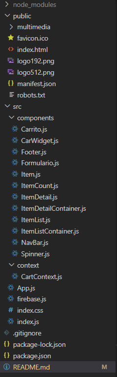

# Ecommerce
## Descripción del sitio: 
### Se trata de una simulación de un Ecommerce, que toma productos de una base de datos realizada en firebase/firestore ,y los visualiza en pantalla con sus distintos datos.
### Además permite filtrar los productos por categorías, renderizando solo aquellos productos pertenecientes a una determinada categoría.
### También permite entrar en el detalle de un producto, para que el usuario pueda tener mas información sobre el mismo, y para que pueda acceder al contador, esto para poder seleccionar la cantidad  que se quiera comprar(el contador no permite agregar mas productos que los que haya en stock). Al ir agregando items al carrito, al lado del símbolo del carrito (en el navbar) se visualizara un contador que mostrará la suma de todas las cantidades de todos los productos seleccionados.
### La página cuenta también con un spinner de carga que se muestra mientras la página se encuentra cargando los productos.
### Al carrito encontrarse vacío muestra un botón que direcciona a la página con los productos. Una vez que se tienen productos en el carrito, al ingresar en el mismo, se tienen diferentes funciones como pueden ser las de borrar un producto del carrito o borrarlos todos, además se muestran los precios y cantidades parciales de cada producto y los precios y cantidades totales de toda la orden de compra.
### El botón Terminar compra del carrito redirige al usuario a una página con un formulario que deberá completar y enviar para poder finalizar con la compra, una vez finalizado y enviado el formulario, los datos del formulario y de los productos comprados se envían a una base de datos en firebase/firestore y se almacenan ahí; a su vez el carrito se vacía al igual que el formulario, dejando todo listo para una próxima compra.

||

## [Link al sitio hosteado](https://ecommerce-simulation-react-firebase.netlify.app)

||

# GIF con ejemplo de la navegación en el sitio:

||

## Estructura del sitio web:

### Index.js (contiene el render) => App.js(componente hijo)

### App.js contiene a BrowserRouter quien a su vez contiene a MiProvider (proviene del archivo CartContext.js) en donde se engloban los componentes: NavBar.js, ItemListContainer.js y ItemDetailContainer.js, Footer.js y Formulario.js

## Componentes e hijos:
||
### NavBar.js => CarWidget.js
||
### ItemListContainer.js :
### => ItemList.js => Item.js 
### => Spinner.js
||
### ItemDetailContainer.js:
### => ItemDetail.js => ItemCount.js
### => Carrito.js => Formulario.js
||
### Footer.js (sin componentes hijos)

||
## Técnologías utilizadas
* React v17.0.2
* Bootstrap v5.1.3
* Firebase v9.6.10
* Rc-rate v2.9.1
* React-dom v17.0.2
* React-router-dom v6.2.2
* React-toastify v8.2.0

||
## Uso / instalación
1. git clone https://github.com/PablodelaTorre/trabajo-react-js-firebase.git 
2. Si no se tienen instaladas todas las tecnologías del punto anterior, deberá instalarlas para posibilitar el funcionamiento de la aplicación.
3. (Sobre directorio descargado) npm run start

